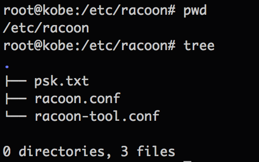

### racon

- [Remote Access VPN with Linux racoon and MAC-OSX](http://blog.packetheader.net/2013/01/remote-access-vpn-with-linux-racoon-and.html)
- [搭建Cisco IPSec VPN under Linux vps](http://britecute.appspot.com/article/articleId=393001,pageId=3)

### Directory

### Testing

    $ service racoon stop
    $ racoon -F -d
    $ service racoon start
